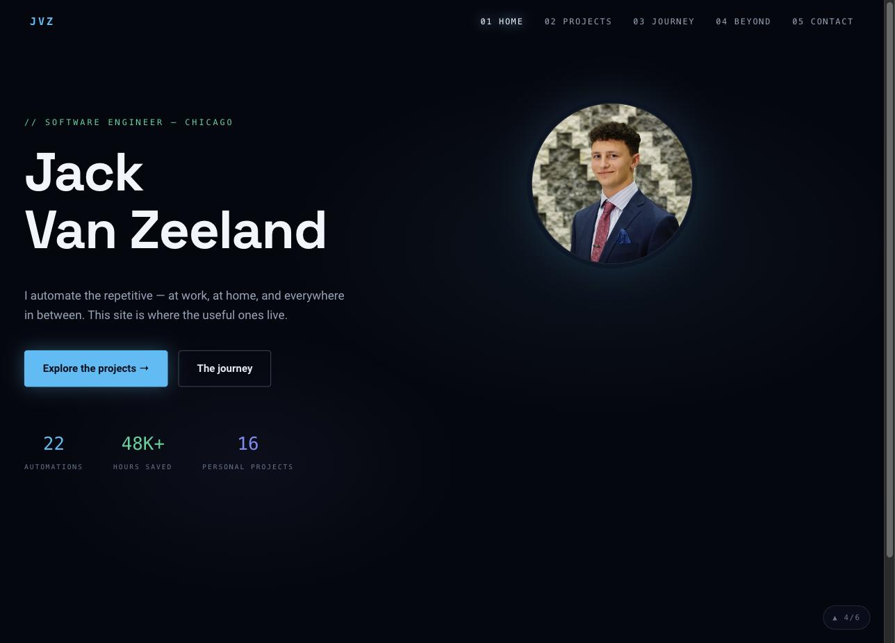
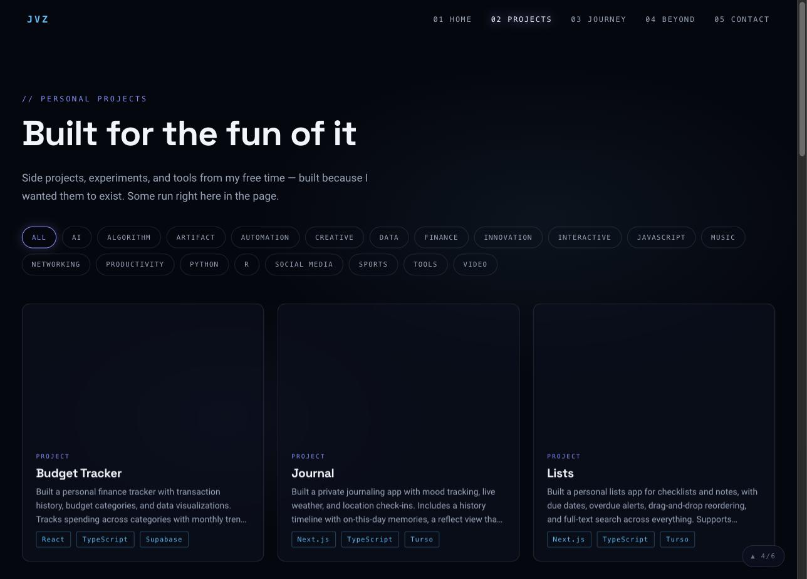
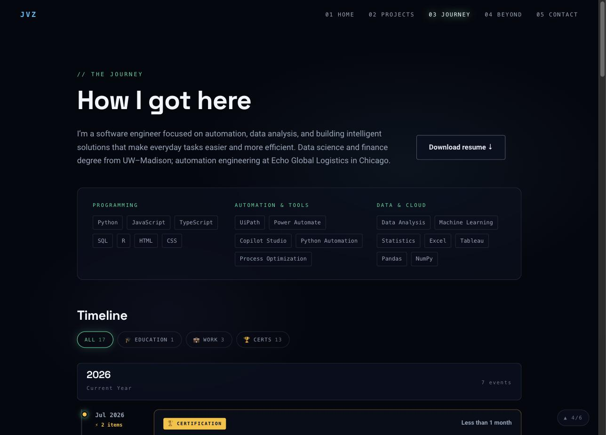
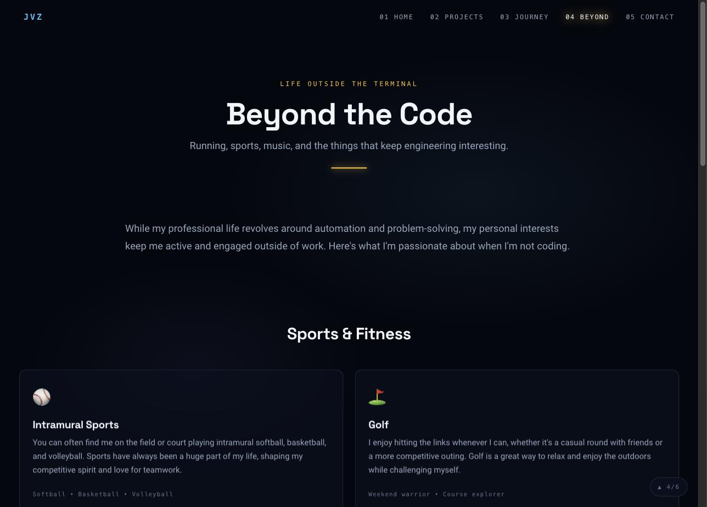
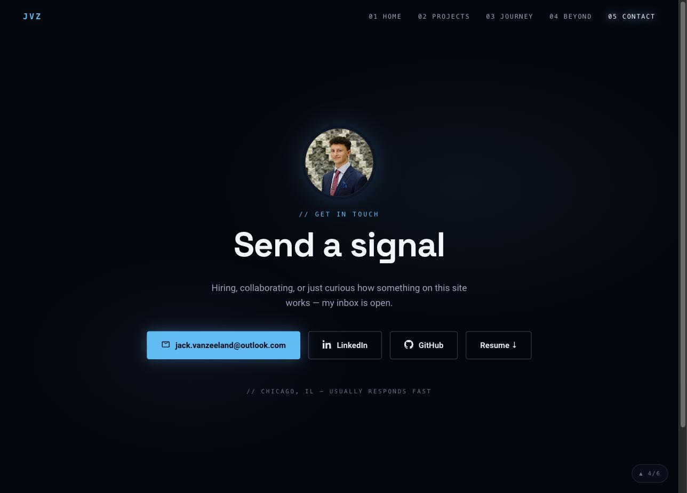

<div align="center">


# jackvanzeeland.com

**A dark-cinematic personal portfolio built around one persistent three.js particle scene.**
~4,000 particles live behind every page and morph into a new formation per section —
a monogram on home, a project lattice, a career constellation, a photo nebula, a signal wave.

[](https://www.typescriptlang.org)
[](https://vitejs.dev)
[](https://threejs.org)
[](https://vitest.dev)
[](LICENSE)
[](https://jackvanzeeland.com)

</div>

<br />

<table>
<tr>
<td width="50%"><br /><sub align="center">Home</sub></td>
<td width="50%"><br /><sub align="center">Projects</sub></td>
</tr>
<tr>
<td width="50%"><br /><sub align="center">Journey</sub></td>
<td width="50%"><br /><sub align="center">Beyond</sub></td>
</tr>
<tr>
<td width="50%"><br /><sub align="center">Contact</sub></td>
<td width="50%"></td>
</tr>
</table>

## How it works

- **One living scene**: a single three.js particle field persists across every route
  (`src/scene/stage.ts`) instead of remounting per page. Navigating morphs it — the
  "JVZ" monogram on home, a project lattice on `/projects`, a career constellation
  built from the actual timeline data on `/journey`, a photo nebula on `/beyond`, a
  signal wave on `/contact` — with a staggered ease and an accent recolor per section.
- **Everything degrades gracefully**: reduced-motion, save-data, or no-WebGL visitors
  never download three.js and get a fully readable static site. Phones get fewer
  particles and only mount the scene after first interaction.
- **A ~150-line router, no framework**: `src/app/router.ts` matches the path and
  `src/app/main.ts` mounts plain `View` modules (`mount`/`unmount`) into `#view-root`.
- **Interactive tools ported intact**: the Wordle solver, Secret Santa matcher, and
  lyric animator run as embedded artifacts inside individual project pages.

See [MAPPING.md](MAPPING.md) for the full route/component map.

## Features

- Deterministic, unit-tested particle formations (`src/scene/formations/`)
- Career timeline rendered from `public/data/timeline.json`, with timezone-safe date
  handling and a filterable Timeline component
- Build-time image pipeline (`sharp`) emitting AVIF/WebP responsive variants
- Legacy-URL 301 redirects generated from a single source of truth and enforced by a
  sync test, so the CloudFront function can never drift from the app's router
- Lighthouse-gated performance budget enforced at build time

## Tech stack

- **Vanilla TypeScript + [Vite](https://vitejs.dev)** — no UI framework
- **[three.js](https://threejs.org)** — `src/scene/SceneDirector.ts` owns the renderer
- **[sharp](https://sharp.pixelplumbing.com)** — build-time image optimization (`scripts/optimize-images.mjs`)
- **[Vitest](https://vitest.dev) + happy-dom** — router, formations, data adapters, timeline rendering

## Getting started

```bash
npm install
npm run dev
```

Open the local URL Vite prints (defaults to `http://localhost:3000`).

## Scripts

| Command | Description |
| --- | --- |
| `npm run dev` | Start the Vite dev server |
| `npm run build` | Image pipeline + redirect/sitemap generators + `tsc` + `vite build` |
| `npm run preview` | Preview the production build |
| `npm test` | Run the Vitest suite |
| `npm run test:watch` | Vitest in watch mode |
| `npm run lint` | ESLint |
| `npm run typecheck` | `tsc --noEmit` |
| `npm run optimize:images` | Rebuild `public/images/opt/` AVIF/WebP variants |

## Project structure

```text
index.html                  single entry (404.html is the S3 SPA fallback)
src/app/                    router, shell, nav, footer, views/
src/scene/                  SceneDirector, formations, capability facade
src/components/             ported tools (WordleSolver, SecretSanta, galleries, Timeline)
src/data/                   projects/artifacts sources + workItems adapter
src/styles/redesign/        design tokens + per-view CSS (dark only)
scripts/                    image pipeline, redirect + sitemap generators
infrastructure.yaml         S3 + CloudFront (SPA routing function, legacy 301s)
public/data/timeline.json   career timeline (drives /journey and its constellation)
```

## Deploy

GitHub Actions (`.github/workflows/deploy.yml`) builds and syncs `dist/` to S3, then
invalidates CloudFront. SPA deep links and legacy-URL 301s are handled by a
CloudFront Function generated from `src/app/legacyRedirects.mjs`
(`scripts/generate-redirects.mjs` keeps `infrastructure.yaml` in sync;
`tests/redirects-sync.test.ts` enforces it). Infrastructure changes are applied via
CloudFormation (`infrastructure.yaml`) — **CI does not apply it**, so a stack update
is a manual step.

## Performance

Lighthouse mobile (build-time gate): **100** on `/`, `/projects`, `/journey` —
LCP ≤ 1.7s, CLS 0. three.js ships as an async chunk after first paint; the entry
bundle is ~16KB raw.

## License

[MIT](LICENSE) © Jack Van Zeeland
